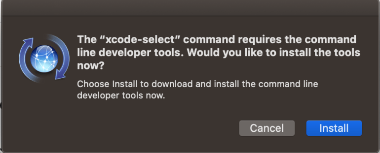
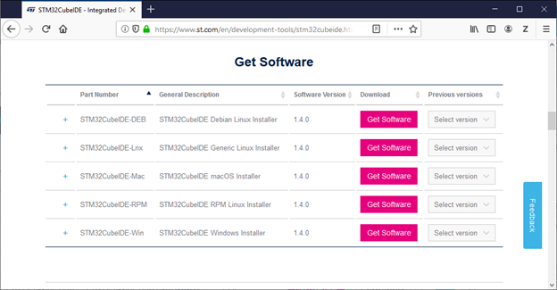
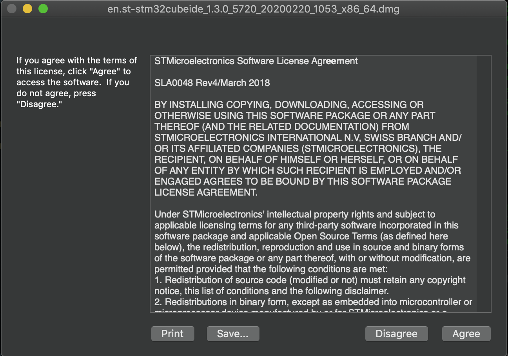
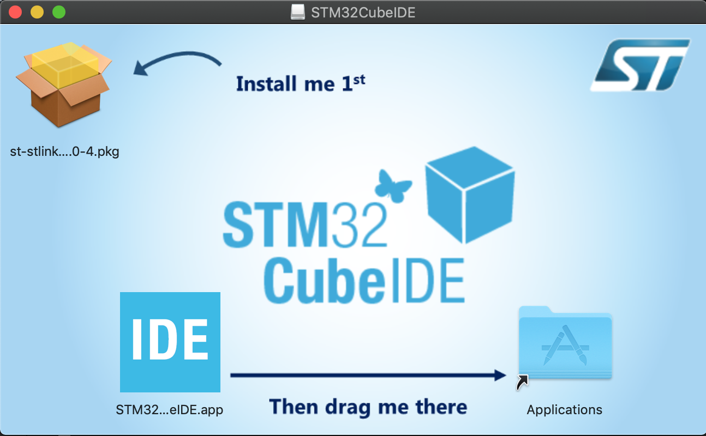
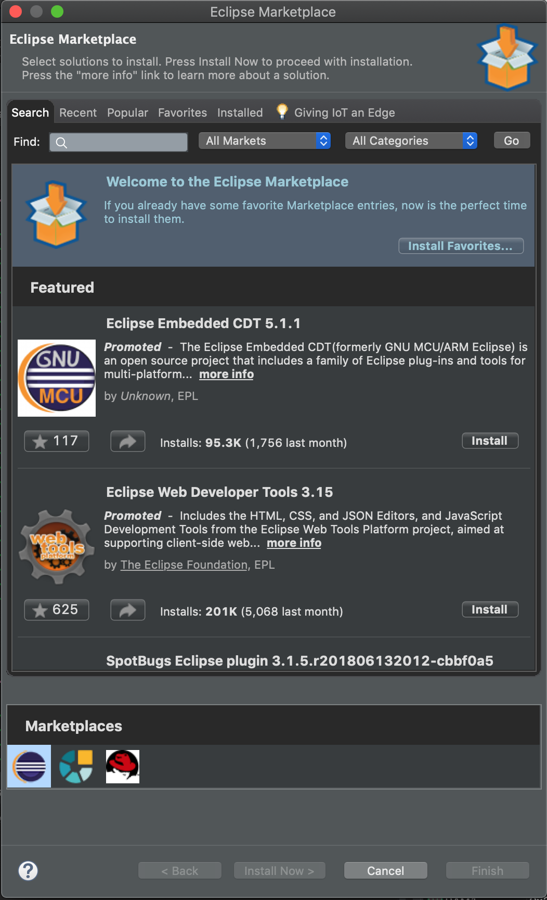
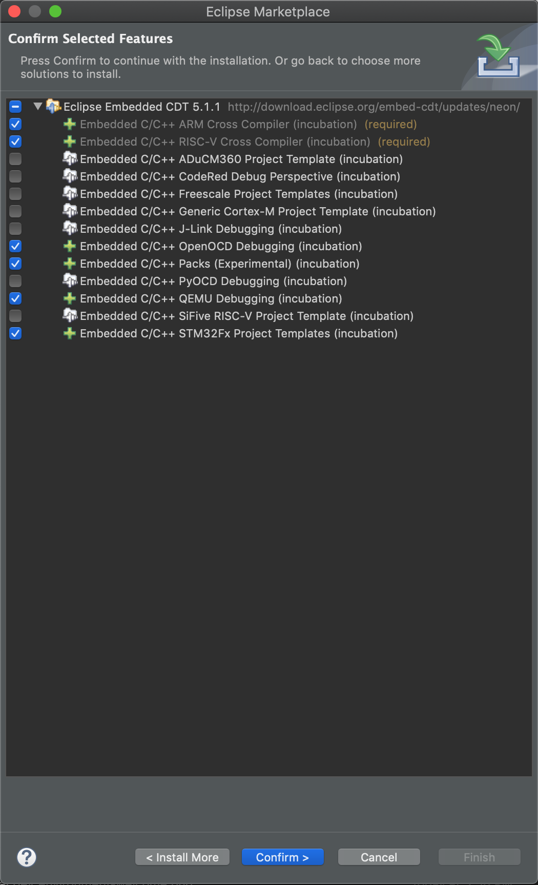
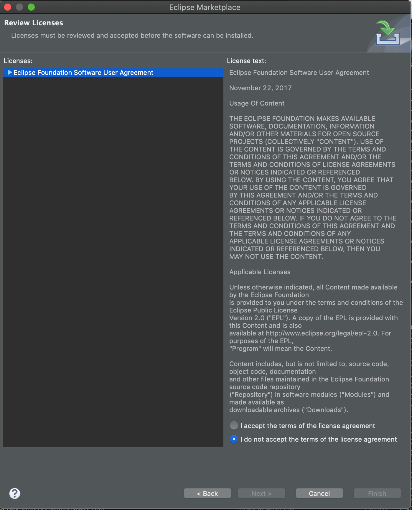
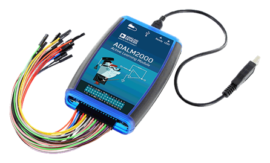

:toc:
:toclevels: 5
:sectnums:
:sectnumlevels: 5
:icons: font
:source-highlighter: highlight.js

= EN.525.615 - Mac Development Environment Setup
//xcode-select --install
//brew install tkdiff

This document will guide you in setting up a development environment for Windows.

INFO:  Ask questions as needed in the `Lab 1 Discussions` area.

== Overview

The following Applications will be used:

* STM32CubeIDE
  ** Eclipse Based Integrated Development extended for STM32 Devices
  ** https://www.st.com/en/development-tools/stm32cubeide.html
* Homebrew
  ** A package manager for the MacOS operating system
  ** Use of Homebrew is optional, but highly recommended
  ** https://brew.sh/
* Git
  ** The Git Version Control Utility
* tkdiff
  ** GUI Based Merge and Diff tool
* gcc
  ** Multiplatform free software compiler suite
* screen
  ** Open source terminal emulator used for serial/uart communication
* npm - Node Package Manager
** Required to install XPack
* xPack Package Manager
  ** Used to install QEMU/ARM Eclipse Tools
  ** https://www.npmjs.com/package/xpm
* QEMU Arm xPack
  ** Open-source multi-platform emulator used to simulate the development board in early labs
  ** https://xpack.github.io/qemu-arm/

== Install Basic Development Tools

=== Common CLI Tools

In MacOS it is relatively easy to get set up with basic command line development tools. This includes things like gcc, g++, git, make, indent, and many more.

To install these tools all at once run the following command in a terminal:

`xcode-select --install`

This will open a prompt asking you to install xcode dev tools, press install.

After this is done, try running `gcc --version` and/or `git --version` in the terminal to see if gcc/git is properly installed.

=== Homebrew

For everything else that is not included with the xcode-select tool there is Homebrew. This gives you an `apt` like package manager that you can use to install software from the command line.

Install homebrew with this command:

[%autofit]
....
/bin/bash -c "$(curl -fsSL https://raw.githubusercontent.com/Homebrew/install/master/install.sh)"
....

Once this is installed you can use the `brew install` command to install the rest of the basic tools.

==== Getting the rest of the required tools

Now run these commands:

* `brew install npm` - Get the node.js package manager (used for qemu)
* `brew install screen` - Terminal multiplexer for connecting to UART
* `brew install tkdiff` - GUI diff tool (if `diff` is too spartan for you)

== Download and Install STM32CubeIDE

STM32CubeIDE is an Eclipse based Integrated Development Environment.
STM32CubeIDE integrates the popular Eclipse IDE, STM32CubeMX Configuration Tool, STM32 Arm Cross-Compiler, and the ST-Link Debugger into one package.

You will need a ST.com user account to be able to download the STM32CubeIDE.
Go to the URL below to create an account:

https://www.st.com/content/st_com/en/user-registration.html

Download the latest version of the STM32CubeIDE software package from the following location:

https://www.st.com/en/development-tools/stm32cubeide.html

Navigate to the `Get Software` section and Click on the `Get Software` box for the STM32CubeIDE-Mac installer.

Extract and run the dmg for STM32CubeIDE that you previous downloaded.

Read the License Agreement and select `I Agree`

Follow the directions on the following dialogue. First double click the pkg file to install the stlink drivers (for connecting to the device itself). Then drag the app to the Applications folder to install the IDE.

== Install QEMU Eclipse Tools

=== Install the xPack Package Manager - xpm

This tool is installed via the node.js package manager that has already been installed in a previous step. Use the following command in a terminal to install:

`npm install --global xpm`

=== Install gnu-mcu-eclipse/qemu and gnu-mcu-eclipse/arm-none-eabi-gcc

Now install arm qemu and the arm compiler using xpm:

`xpm install --global @xpack-dev-tools/qemu-arm@latest`

`xpm install --global @gnu-mcu-eclipse/arm-none-eabi-gcc`

These commands will install the tools to a fixed directory located at `~/Library/xPacks/` . In this area will be bin directories holding the binaries for these tools.

=== Install the GNU MCU Eclipse Plugin

Tip: For more information see https://gnu-mcu-eclipse.github.io/plugins/install/

* From inside Eclipse (i.e. STM32CubeIDE)
* Go to the Eclipse menu → Help → Eclipse Marketplace…,
* Find **Eclipse Embedded CDT** and press install

When prompted ensure the following packages are selected:

Accept the license aggreement and select `Finish`

<<<

== ADALM2000 and Scopy

The lab kit includes the ADALM2000 (M2K) Active Learning Module USB-Powered multifunctional lab tool.

ADALM2000 has the following features:

* Two-channel USB digital oscilloscope
* Two-channel arbitrary function generator
* 16-channel digital logic analyzer (3.3V CMOS and 1.8V or 5V tolerant, 100MS/s)
* 16-channel pattern generator (3.3V CMOS, 100MS/s)
* 16-channel virtual digital I/O
* Two input/output digital trigger signals for linking multiple instruments (3.3V CMOS)
* Single channel voltmeter (AC, DC, ±20V)
* Network analyzer – Bode, Nyquist, Nichols transfer diagrams of a circuit. Range: 1Hz to 10MHz
* Spectrum Analyzer – power spectrum and spectral measurements (noise floor, SFDR, SNR, THD, etc.)
* Digital Bus Analyzers (SPI, I²C, UART, Parallel)
* Two programmable power supplies (0…+5V , 0…-5V)

TIP: For more information check out their wiki: https://wiki.analog.com/university/tools/m2k

The Scopy GUI Application is used to control the ADALM2000 device.
Follow the detailed installations instructions at the URL below to install Scopy for MacOS.

https://wiki.analog.com/university/tools/m2k/scopy

